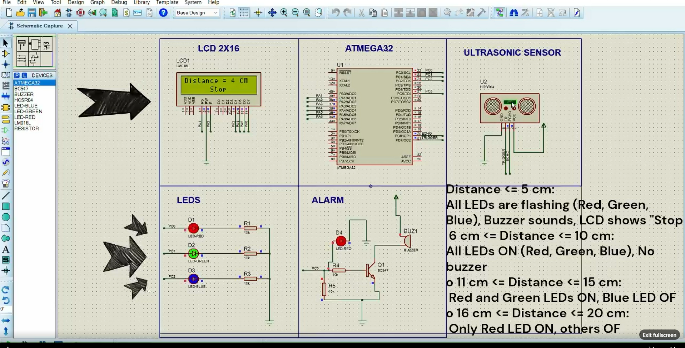
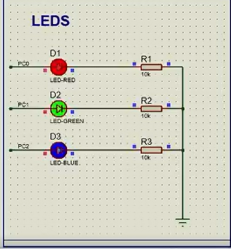

# Car Parking Sensor System

A sophisticated embedded systems project implementing an intelligent car parking assistance system using ATmega32 microcontroller, ultrasonic distance measurement, and real-time feedback mechanisms.

## Table of Contents

* [Overview](#overview)
* [Features](#features)
* [Tech Stack](#tech-stack)
* [Architecture](#architecture)
* [Project Structure](#project-structure)
* [Getting Started](#getting-started)
* [Screenshots](#screenshots)
* [Connect With Me](#connect-with-me)

---

## Overview

The Car Parking Sensor System is an embedded solution designed to enhance vehicle parking safety by providing accurate distance measurements and progressive warning systems. Utilizing the ATmega32 microcontroller as the central processing unit, the system interfaces with an HC-SR04 ultrasonic sensor to measure distances to nearby obstacles in real-time.

The system employs a multi-modal warning approach, combining visual indicators (tri-color LED array), auditory alerts (buzzer), and digital display (16x2 LCD) to provide comprehensive feedback to the driver. The implementation follows a layered software architecture, ensuring modularity, maintainability, and scalability.

**Project Context**
- **Program:** Standard Embedded Diploma - Mini Project 4
- **Institution:** Edges For Training
- **Development Period:** October 2024

**Key Objectives**
- Implement accurate distance measurement using ultrasonic sensing technology
- Provide intuitive driver feedback through multiple output channels
- Demonstrate professional embedded systems development practices
- Showcase layered architecture design principles

---

## Features

### Core Capabilities

**Ultrasonic Distance Measurement**
- Real-time distance calculation using HC-SR04 sensor
- Measurement range: 2 cm to 400 cm
- Update frequency: Continuous monitoring
- Precision: ±1 cm accuracy

**LCD Display Interface**
- 16x2 character LCD in 4-bit mode
- Real-time distance display in centimeters
- Critical proximity warning ("Stop" message)
- Clear, readable interface for driver feedback

**Progressive LED Warning System**
- Three-color LED array (Red, Green, Blue)
- Distance-based activation patterns
- Flashing mode for critical proximity
- Intuitive visual feedback

**Auditory Alert System**
- Buzzer activation at critical distances
- Clear audible warning signal
- Transistor-driven for optimal performance

**Intelligent Control Logic**
- State-based distance evaluation
- Dynamic LED pattern control
- Threshold-based warning activation
- Continuous system monitoring

### Distance-Based Alert Mapping

| Distance Range | Red LED | Green LED | Blue LED | Buzzer | LCD Display | Status |
|----------------|---------|-----------|----------|--------|-------------|---------|
| ≤ 5 cm | Flashing | Flashing | Flashing | Active | "Stop" | Critical |
| 6-10 cm | ON | ON | ON | Inactive | Distance | Very Close |
| 11-15 cm | ON | ON | OFF | Inactive | Distance | Close |
| 16-20 cm | ON | OFF | OFF | Inactive | Distance | Moderate |
| > 20 cm | OFF | OFF | OFF | Inactive | Distance | Safe |

---

## Tech Stack

### Hardware Components

**Microcontroller**
- Model: ATmega32
- Operating Frequency: 16 MHz
- Architecture: 8-bit AVR RISC
- Flash Memory: 32 KB
- SRAM: 2 KB
- EEPROM: 1 KB

**Sensors & Input Devices**
- HC-SR04 Ultrasonic Distance Sensor
  - Operating Voltage: 5V DC
  - Measurement Range: 2-400 cm
  - Measurement Angle: 15 degrees
  - Trigger Pulse: 10µs

**Display & Output Devices**
- 16x2 Character LCD Display (4-bit mode)
- Red LED with current-limiting resistor
- Green LED with current-limiting resistor
- Blue LED with current-limiting resistor
- Buzzer with transistor driver circuit

**Supporting Components**
- BC547 NPN Transistor (buzzer driver)
- Resistors (10kΩ, current-limiting)
- Crystal Oscillator: 16 MHz
- Capacitors for crystal stabilization

### Software & Development Tools

**Programming Environment**
- Language: C (ISO C99)
- IDE: Eclipse IDE with AVR Plugin
- Compiler: AVR-GCC
- Build System: Eclipse CDT (C/C++ Development Tooling)
- Debugger: AVR GDB

**Development Workflow**
- Version Control: Git
- Simulation: Proteus Design Suite
- Programming Tool: USBasp or compatible AVR programmer

**Software Architecture**
- Layered Architecture Model
- MCAL (Microcontroller Abstraction Layer)
- HAL (Hardware Abstraction Layer)
- Application Layer

---

## Architecture

### Layered Software Architecture

The project implements a professional three-layer architecture pattern, ensuring clean separation of concerns and promoting code reusability.

```
┌─────────────────────────────────────────────────────────────┐
│                    APPLICATION LAYER                        │
│                                                             │
│  - Main control logic (parking_sensor.c)                   │
│  - Distance evaluation state machine                       │
│  - LED pattern control                                     │
│  - Display update management                               │
│  - Buzzer activation logic                                 │
└─────────────────────────────────────────────────────────────┘
                              ↕
┌─────────────────────────────────────────────────────────────┐
│          HARDWARE ABSTRACTION LAYER (HAL)                   │
│                                                             │
│  ┌──────────────┐ ┌──────────────┐ ┌──────────────┐       │
│  │     LCD      │ │  Ultrasonic  │ │    Buzzer    │       │
│  │    Driver    │ │    Driver    │ │    Driver    │       │
│  └──────────────┘ └──────────────┘ └──────────────┘       │
│                   ┌──────────────┐                         │
│                   │     LED      │                         │
│                   │    Driver    │                         │
│                   └──────────────┘                         │
└─────────────────────────────────────────────────────────────┘
                              ↕
┌─────────────────────────────────────────────────────────────┐
│      MICROCONTROLLER ABSTRACTION LAYER (MCAL)               │
│                                                             │
│  ┌──────────────┐              ┌──────────────┐            │
│  │     GPIO     │              │     ICU      │            │
│  │    Driver    │              │   Driver     │            │
│  └──────────────┘              └──────────────┘            │
│                                                             │
│  - Pin configuration and control                           │
│  - Timer/Counter configuration                             │
│  - Interrupt management                                    │
└─────────────────────────────────────────────────────────────┘
                              ↕
┌─────────────────────────────────────────────────────────────┐
│                      HARDWARE LAYER                         │
│                                                             │
│  ATmega32 | HC-SR04 | LCD | LEDs | Buzzer                  │
└─────────────────────────────────────────────────────────────┘
```

### Driver Specifications

#### MCAL Layer

**GPIO Driver (gpio.c/h - 6.9 KB)**
- Pin direction configuration (input/output)
- Digital read/write operations
- Port-level manipulation
- Pull-up resistor control

**ICU Driver (icu.c/h - 2.1 KB)**
- Input Capture Unit configuration
- Timer1 in capture mode
- Edge detection (rising/falling)
- Prescaler configuration (F_CPU/8)
- Callback mechanism for edge events

#### HAL Layer

**LCD Driver (lcd.c/h - 10.8 KB)**
- 4-bit mode communication
- Command and data transmission
- Character and string display
- Integer to string conversion
- Cursor positioning
- Screen clearing operations

**Ultrasonic Driver (ultrasonic_sensor.c/h - 3.3 KB)**
- Trigger pulse generation
- Echo pulse measurement using ICU
- Distance calculation (time to distance conversion)
- Callback integration with ICU driver

**Buzzer Driver (buzzer.c/h - 1.2 KB)**
- Initialization and configuration
- ON/OFF control functions
- Transistor-based driving

**LED Driver (led.c/h - 3.9 KB)**
- Individual LED control
- Multi-LED support
- Toggle functionality for flashing
- Configurable port/pin assignments

### Pin Configuration

#### ATmega32 Pin Assignments

**Port A - LCD Interface**
| Pin | Function | Description |
|-----|----------|-------------|
| PA1 | LCD RS | Register Select |
| PA2 | LCD E | Enable Signal |
| PA3 | LCD D4 | Data Bit 4 |
| PA4 | LCD D5 | Data Bit 5 |
| PA5 | LCD D6 | Data Bit 6 |
| PA6 | LCD D7 | Data Bit 7 |

**Port C - LEDs and Buzzer**
| Pin | Function | Description |
|-----|----------|-------------|
| PC0 | Red LED | Proximity indicator |
| PC1 | Green LED | Proximity indicator |
| PC2 | Blue LED | Proximity indicator |
| PC5 | Buzzer | Audio alert (via transistor) |

**Port D - Ultrasonic Sensor**
| Pin | Function | Description |
|-----|----------|-------------|
| PD6 | Echo | Ultrasonic echo input (ICU) |
| PD7 | Trigger | Ultrasonic trigger output |

**Additional Connections**
- LCD RW: Connected to GND (write mode only)
- LCD VSS: Connected to GND
- LCD VDD: Connected to +5V
- LCD VEE: Connected to contrast control potentiometer

---

## Project Structure

```
Car-Parking-Sensor/
│
├── .settings/                     # Eclipse IDE configuration
│
├── Debug/                         # Build output directory
│   ├── *.o                       # Object files
│   ├── *.elf                     # Executable and Linkable Format
│   ├── *.hex                     # Intel HEX file for flashing
│   └── *.map                     # Memory map file
│
├── MCAL/                          # Microcontroller Abstraction Layer
│   ├── gpio.c                     # GPIO driver implementation (6,956 bytes)
│   ├── gpio.h                     # GPIO driver interface (3,673 bytes)
│   ├── icu.c                      # ICU driver implementation (2,103 bytes)
│   └── icu.h                      # ICU driver interface (2,062 bytes)
│
├── HAL/                           # Hardware Abstraction Layer
│   ├── lcd.c                      # LCD driver implementation (10,881 bytes)
│   ├── lcd.h                      # LCD driver interface (4,211 bytes)
│   ├── ultrasonic_sensor.c        # Ultrasonic driver implementation (3,324 bytes)
│   ├── ultrasonic_sensor.h        # Ultrasonic driver interface (2,323 bytes)
│   ├── buzzer.c                   # Buzzer driver implementation (1,244 bytes)
│   ├── buzzer.h                   # Buzzer driver interface (1,122 bytes)
│   ├── led.c                      # LED driver implementation (3,918 bytes)
│   └── led.h                      # LED driver interface (2,327 bytes)
│
├── APP/                           # Application Layer
│   └── parking_sensor.c           # Main application logic (5,278 bytes)
│
├── COMMON/                        # Common definitions and utilities
│   ├── std_types.h                # Standard type definitions (1,446 bytes)
│   └── common_macros.h            # Common macro definitions (1,218 bytes)
│
├── .cproject                      # Eclipse C project configuration
├── .project                       # Eclipse project metadata
│
└── README.md                      # Project documentation
```

### Project Statistics

- **Total Source Code:** Approximately 6,500+ lines
- **Number of Drivers:** 6 (GPIO, ICU, LCD, Ultrasonic, Buzzer, LED)
- **Architecture Layers:** 3 (MCAL, HAL, Application)
- **Development Environment:** Eclipse IDE with AVR Plugin
- **Code Size:** Approximately 35 KB source files

---

## Getting Started

### Prerequisites

**Hardware Requirements**
- ATmega32 microcontroller
- HC-SR04 ultrasonic sensor
- 16x2 LCD display
- RGB LEDs (Red, Green, Blue)
- Buzzer
- BC547 transistor
- Resistors and capacitors as per circuit design
- AVR programmer (USBasp or equivalent)
- Power supply (5V regulated)

**Software Requirements**
- AVR-GCC compiler toolchain
- Eclipse IDE with AVR plugin (optional but recommended)
- Proteus Design Suite (for simulation)
- AVRdude (for programming)
- Git (for version control)

### Configuration

**System Configuration**
- CPU Frequency: 16 MHz (F_CPU = 16000000UL)
- ICU Prescaler: F_CPU/8 (2 MHz)
- LCD Mode: 4-bit data mode
- ICU Edge Detection: Rising edge as first edge

**Modifying Pin Assignments**

Pin assignments can be modified in the respective header files:

**Buzzer Configuration (buzzer.h)**
```c
#define BUZZER_PORT_ID    PORTC_ID
#define BUZZER_PIN_ID     PIN5_ID
```

**Ultrasonic Configuration (ultrasonic_sensor.h)**
```c
#define ULTRASONIC_TRIGGER_PORT_ID    PORTD_ID
#define ULTRASONIC_TRIGGER_PIN_ID     PIN7_ID
```

**LED Configuration (led.h)**
```c
#define RED_LED_PORT_ID      PORTC_ID
#define RED_LED_PIN_ID       PIN0_ID
#define GREEN_LED_PORT_ID    PORTC_ID
#define GREEN_LED_PIN_ID     PIN1_ID
#define BLUE_LED_PORT_ID     PORTC_ID
#define BLUE_LED_PIN_ID      PIN2_ID
```

**LCD Configuration (lcd.h)**
```c
#define LCD_RS_PORT_ID       PORTA_ID
#define LCD_RS_PIN_ID        PIN1_ID
#define LCD_E_PORT_ID        PORTA_ID
#define LCD_E_PIN_ID         PIN2_ID
#define LCD_DATA_PORT_ID     PORTA_ID
```
## Screenshots

### System Simulation



*Figure 1: Complete system simulation in Proteus showing ATmega32, ultrasonic sensor, LCD display, LED indicators, and buzzer circuit*

### Distance Measurement Display


*Figure 2: LCD displaying real-time distance measurement in centimeters during normal operation*

### Critical Proximity Warning


*Figure 3: System in critical warning state with LCD showing "Stop" message, all LEDs flashing, and buzzer active (distance ≤ 5cm)*

### LED Indicator Patterns



*Figure 4: Different LED activation patterns corresponding to various distance ranges*

### Circuit Schematic


*Figure 5: Detailed circuit schematic showing all component connections and pin assignments*

### System in Operation


*Figure 6: Physical hardware setup demonstrating the complete parking sensor system*

---
## Connect With Me

### Professional Profiles

[](https://www.linkedin.com/in/asser-hossam)

[](https://github.com/asserhossam74)

[](mailto:asserelhosary@gmail.com)

---

### Project Repository

**GitHub Repository:**  
https://github.com/asserhossam74/Car-Parking-Sensor

---

### Contact Information

For questions, collaborations, or technical discussions:

- **LinkedIn:** https://www.linkedin.com/in/asser-hossam  
- **Email:** asserelhosary@gmail.com  
- **GitHub:** https://github.com/asserhossam74

---

## Acknowledgments

**Mohamed Tarek** - Instructor and Technical Supervisor at Edges For Training

**Edges For Training** - For providing comprehensive embedded systems training and professional development environment

---
